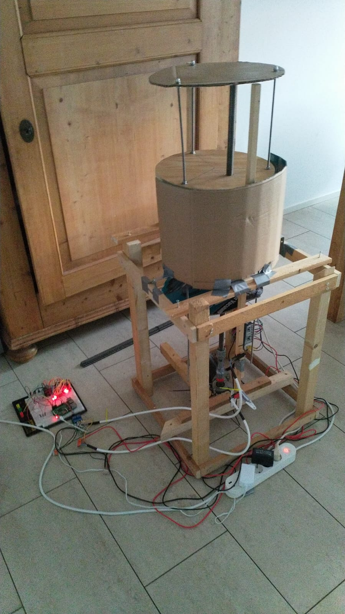

# iot-edge-beerlift
Beer lift connected to the Azure cloud using Azure IoT edge.

*Note*: This is still a work in progress:



beerlift-proto2.png

# Introduction

This project involves a beer lift that will pop out of the floor when summoned using a two-way motor.

The beer lift is connected to the Azure cloud using an Azure IoT Edge module running of a Raspberry Pi (ow another device with GPIO capabilities (at least I2C, SPI and multiple digital pins)). 

The lift can be moved up and down from the cloud. 

The solution also measures the temperature and it measures which bottles are taken out. Each bottle has its own unique position, guided by LEDs. 

This beer lift is designed for up to sixteen bottles.

Empty beer bottle holders are lit using a LED. A micro switch detect the absence of a bottle. Once a bottle is placed in the holder, the LED is dimmed (to protect the bee quality).

A moisture/water sensor can detect any leackage in the construction.

# Materials used

## For the Beer Lift

It's up to you to build your own beerlift. These are the (second hand) components I use:

* Thread screw bar (~1 meter) + nut
* Lenze electromotor with gearbox - type SSN31-1UHAR-056C21 (second hand) (340V 3 Phase downscaled to 220V 1 Phase)
* Gerwah DKN-100 Miniature metal bellows coupling with clamping hubs
* Capacitor 12.0uF (for switching back to 1 phase)
* Two relays, Siemens Sirius 3RT1015-1BB41 (For switching 220V on the motor, one in each direction)
* Two Snap-Action Switches with roller Lever; 3-Pin (for normally closed usage)
* Wires, Wago connectors, etc.

You can deviate from this of course, using your own hardware set.

## For the 16 beerholders

* a LED
* a Snap-Action switch

## For the controller
* Raspberry Pi 3 with Buster
* RPi GPIO extension connector and flat cable
* Two-channel 5V relais module
* DHT22 AM2302 Digital temperature and humidity sensor
* One 10K resistor for the DHT22
* Two MCP23017 - i2c 16 input/output port expanders
* Soil moisture sensor (Robodyn has an alog one which can also be used on a digital port)
* Prototyping PCB boards, wires, etc

The logic in this module is pretty bound to this hardware. If you use other sensors or expanders, you probably have to rewrite this module.

# Azure IoT Edge

The Azure IoT Edge module is available [here](https://hub.docker.com/repository/docker/svelde/iot-edge-beerlift).

This repo is only available for Raspberry PI (ARM-32) due to the usage of GPIO.

## Telemetry

Every 'Interval' milliseconds, the beerlift is inspected for changes in the bottle holders. at the same time, the state of the beerlift is checked.

The state can be:

* Down
* Going up
* Up
* Going down
* Unknown (exception state / debug state)

If any bottles are taken out (or refilled) or the state is changes, a message is send.

If the BeerLift detects flooding (water inside the BeerLift) this will result in cloud messages ALSO.

Message:

```
{
    string deviceId,
    bool slot01,
    bool slot02,
    bool slot03,
    bool slot04,
    bool slot05,
    bool slot06,
    bool slot07,
    bool slot08,
    bool slot09,
    bool slot10,
    bool slot11,
    bool slot12,
    bool slot13,
    bool slot14,
    bool slot15,
    bool slot16,
    timeStamp,
    string liftState,
    bool flooded
}
```

In case of flooding, an extra message property *"Alarm": "Flooded"* is added. 

## Direct Methods

The following direct methods are available:

* Up
* Down
* Ambiant
* Circus
* FindEmptySlot
* Roulette
* MarkPosition
* Advertise
* BottleHolders

*Note* Method names are case sensitive

#### Direct Method - Up

No JSON body needed to be send.

Sends the lift up for the duration of 'UpDownInterval' milliseconds (20000 by default).

*Note*: due to the time to complete this action, a time out can occur.

Response:

```
{
    int responseState,
    string errorMessage
}
```

### Direct Method - Down

No JSON body needed to be send.

Sends the lift down for the duration of 'UpDownInterval' milliseconds (20000 by default).

*Note*: due to the time to complete this action, a directmethod time out could occur.

After Down is executed, all leds are dimmed.

Response:

```
{
    int responseState,
    string errorMessage
}
```

### Direct Method - Ambiant

No JSON body needed to be send.

Reads the temperature and humidity of the DHT22.

Due to the behavior of the DHT, multiple reads are needed unit a actual temperature is read.

If no value is retrieved succesfully, -273 degrees Celsius is returned.

The state of the lift can be seen too. 

Response:

```
{
    int responseState,
    string errorMessage,
    double temperature,
    double humidity,
    string liftState,
    bool flooded
}
```

### Direct Method - Circus

No JSON body needed to be send.

Lits up the LED lights in a semi-random pattern for a few seconds.

Response:

```
{
    int responseState,
    string errorMessage
}
```

*Note*: Enjoy the show.

### Direct Method - FindEmptySlot

No JSON body needed to be send.

Returns the first empty slot (1-16) where no bottle is placed. 

If all slots are occupied, it returns 0.

It also flashes the LED at the empty slot found.

Response:

```
{
    int responseState,
    string errorMessage,
    int emptySlot
}
```

### Direct Method - Roulette

No JSON body needed to be send.

Returns the a random slot (1-16) where a bottle is placed. 

If all slots are already empty, it returns 0.

It also flashes the LED at the random slot selected.

Response:

```
{
    int responseState,
    string errorMessage,
    int shot
}
```

*Note*: Great for an alternative version of 'Russian Roullete'

### Direct Method - MarkPosition

A JSON body is needed to be send:

```
{
    int position
}
```

It flashes the LED at the markted slot.

Response:

```
{
    int responseState,
    string errorMessage
}
```

### Direct Method - Advertise

No JSON body needed to be send.

Lits up all LED lights for 20 seconds so all bottle lables are shown and therefor 'advertised'.

Response:

```
{
    int responseState,
    string errorMessage
}
```

### Direct Method - BottleHolders

No JSON body needed to be send.

Returns instanly the current bottle holder information, liftstate and flooding.

Response:

```
{
    BeerLiftMessage : {
        string deviceId,
        bool slot01,
        bool slot02,
        bool slot03,
        bool slot04,
        bool slot05,
        bool slot06,
        bool slot07,
        bool slot08,
        bool slot09,
        bool slot10,
        bool slot11,
        bool slot12,
        bool slot13,
        bool slot14,
        bool slot15,
        bool slot16,
        DateTime timeStamp,
        string liftState,
        bool isFlooded
    },
    int responseState,
    string errorMessage
}
```

## Module Twin

The module is configurable using the desired properties of the module twin:

* interval (in milliseconds, default 5000) - the polling interval for the hardware
* upDownInterval (in milliseconds, default 20000) - the interval for moving up or down the beer lift
* upRelayPin (default pin 17) - digital GPIO for controlling the Up relay
* downRelayPin (default pin 27) - digital GPIO for controlling the Down relay
* floodedPin (default pin 23) - digital GPIO for reading the moisture sensor (which is an analog sensor)
* dht22Pin (default pin 4) - digital GPIO for reading the up relay
* i2cAddressWrite (default 0x22) - i2c address for controlling the LEDs
* i2cAddressRead (default 0x20) - i2c address for controlling the switches
* silentFlooding (default false) - turn off sending flooding messages. The internal logging is still recording the warnings. Messages triggered when the lift state changes will still report the flooding state
* inDebugMode (default false) - prevents up/down movement of lift while being debugged 

# Raspberry Pi

## Operating system 

We run the lastest Raspbian version, Buster. 

A version two of the Raspberry PI will work too. 

## installing Azure IoT Edge

Follow this [description](https://docs.microsoft.com/en-us/azure/iot-edge/support#tier-2) to make it possible to install Azure IoT Edge on Buster:

```
sudo apt-get install libssl1.0.2
```

After that, perform the regular [installation](https://docs.microsoft.com/en-us/azure/iot-edge/how-to-install-iot-edge-linux) on Buster. 

*Note*: The installation guide is referring to Raspbian Stretch but that is applicable to Buster too with the fix above.

*Note*: The module runs on both Azure IoT Edge version 1.1 (LTS) and 1.2.

## Azure IoT Edge

Azure IoT Edge is the perfect solution for our controller unit. We are able to program in C# .Net Core 3.1 and access the GPIO of the Raspberry PI.

For this we need to run the module with elevated rights using these Container Create Options:

```
{
    "HostConfig": {
        "Privileged": true
    }
}
```

## Raspberry PI configuration

### SSH

Because the Raspberry PI will work headless, a fixed IP address comes in handy for SSH.

If you have installed Buster with a dashboard, SSH can be configured in the "Raspberry Pi Configuration" application, on the interfaces page.

This has only to be done once.

### GPIO configuration

We will use both the I2C and 1-Wire GPIO busses. These have to be activated before these are available.

I2C and 1-Wire can be configured in the "Raspberry Pi Configuration" application, on the interfaces page. Please reboot the Raspberry PI afterwards. 

This has only to be done once.

### I2C detect

In this configuration, we use two I2C addresses: 0x20 (for switch input) and 0x22 (for led output).

If you are not sure about your configuration, please check:

```
sudo i2cdetect -y 1
```

# Safety

Please be aware this beer lift is operating on 220 Volts.

**If you are not confident with this voltage or with the materials used, please do not attempt this at home**

# Links

The MCP23017 access is based on library https://github.com/dotnet/iot/tree/master/src/devices/Mcp23xxx

The DHT22 access is based on library https://github.com/dotnet/iot/tree/master/src/devices/Dhtxx 

# Legal

Enjoy this beerlift as much as we do.

We actively encouraging a responsible attitude. IoT and beer are a great combination but not at the same time!

And remember, drink responsibly: quality over quantity.
